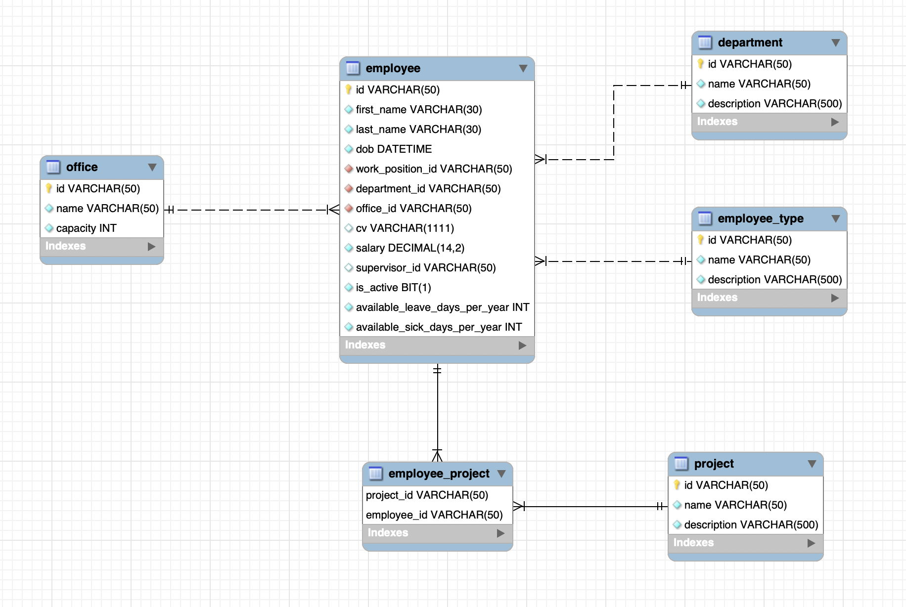

<h1 align="center"> ⚙ Employee Management System </h1>

Employee Management system manages the employees of a specific organization.

## ERD - Entity Relationship Diagram
Following [Resource](https://www.softwareideas.net/a/1565/Employee-Management-System--ER-diagram-) was used to implement the ERD.

## Application Class Diagram

### Note
* `Press E to expand package in Class diagmram`
* `Use the following tool-bar to show dependencies and other settings.`

## Mappings

### Employee Mappings
Following are the Endpoints for `Employee`:

URL | Request | Description
--- | --- | --- |
api/vi/employee | GET | Get All Employees
api/vi/employee/{employee_id} | GET | Get Employee with given Id
api/vi/employee | POST |  Insert a new Employee
api/vi/employee/{employee_id} | PUT | Update an employee having Id 
api/vi/project/{project_id}/{employee_id} | PUT | Assign project to an employee
api/vi/employee/{employee_id} | DELETE | Delete an employee having Id

### Project Mappings
Following are the Endpoints for `Project`:

URL | Request | Description
--- | --- | --- |
api/vi/project | GET | Get All Projects
api/vi/project/{project_id} | GET | Get Project with given Id
api/vi/project | POST |  Insert a new Project
api/vi/project/{project_id} | PUT | Update a Project having Id
api/vi/project/{employee_id}/{project_id} | PUT | Add employee to a project
api/vi/project/{project_id} | DELETE | Delete a Project having Id

### Office Mappings
Following are the Endpoints for `Office`:

URL | Request | Description
--- | --- | --- |
api/vi/office | GET | Get All Offices
api/vi/office/{office_id} | GET | Get Office with given Id
api/vi/office | POST |  Insert a new Office
api/vi/office/{office_id} | PUT | Update an Office having Id
api/vi/office/{office_id} | DELETE | Delete an Office having Id

### Department Mappings
Following are the Endpoints for `Department`:

URL | Request | Description
--- | --- | --- |
api/vi/department | GET | Get All Departments
api/vi/department/{department_id} | GET | Get Department with given Id
api/vi/department | POST |  Insert a new Department
api/vi/department/{department_id} | PUT | Update a Department having Id
api/vi/department/{department_id} | DELETE | Delete a Department having Id

### Employee-Type Mappings
Following are the Endpoints for `Employee-type`:

URL | Request | Description
--- | --- | --- |
api/vi/employee-type | GET | Get All Departments
api/vi/employee-type/{employee_type_id} | GET | Get Employee-type with given Id
api/vi/employee-type | POST |  Insert a new Employee-type
api/vi/employee-type/{employee_type_id} | PUT | Update a Employee-type having Id
api/vi/employee-type/{employee_type_id} | DELETE | Delete a Employee-type having Id

* Perform following tasks on completion:
    * Remove unwanted imports.